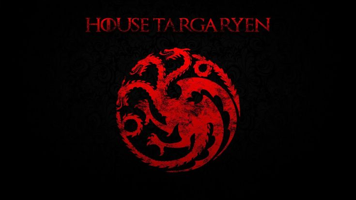

<p align="center">
  
</p>

# 🐉 Targaryen Archives

> *"Fire and Blood."*

A MySQL database project that models the history of **House Targaryen**, including characters, family relationships, marriages, dragons, dragon riders, wars, and battles.

Inspired by the world created by George R. R. Martin.

---

## 🔥 Features

- 👑 Targaryen characters
- 🩸 Family relationships
- 💍 Marriages
- 🐉 Dragons and their riders
- ⚔️ Wars and battles
- 🔗 Relational database design using primary and foreign keys
- 📊 SQL queries using `JOIN`, `WHERE`, and other SQL concepts

---

## 🗂️ Project Structure

```text
targaryen-archives/
│
├── database/
│   └── 01_schema.sql
│
├── data/
│   ├── characters.sql
│   ├── relationships.sql
│   ├── marriages.sql
│   ├── dragons.sql
│   ├── dragon_riders.sql
│   ├── wars.sql
│   └── battles.sql
│
├── queries/
│   ├── 02_marriage_queries.sql
│   ├── 03_dragon_queries.sql
│   └── 04_war_queries.sql
│
├── README.md
└── .gitignore
🛠️ Technologies
MySQL
SQL
Git
GitHub
Visual Studio Code
🚀 Getting Started

Run the schema:

SOURCE database/01_schema.sql;

Then load the data files from the data/ directory.

🗺️ Roadmap
 Characters
 Family relationships
 Marriages
 Dragons and riders
 Wars and battles
 Expand the Targaryen family tree
 Add rulers and succession
 Add historical events
 Advanced SQL queries
 Entity Relationship Diagram
📖 Inspiration

Inspired by the fictional history of House Targaryen from A Song of Ice and Fire and Fire & Blood by George R. R. Martin.

This is a fan-made educational project created for learning SQL and relational database design